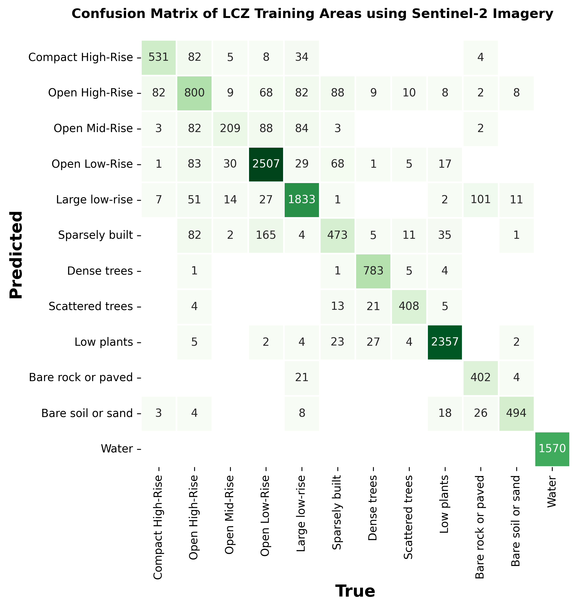

# Urban Heat Island Analysis using Local Climate Zones Classified by Random Forest Trained on Sentinel-2A Imagery and Urban Canopy Parameters

**Work in Progress 

### 1. Local Climate Zones

The Urban Heat Island (UHI) effect is a phenomena whereby air temperatures in urban environments are significantly higher when compared to rural areas. Such an effect is largely due to the thermal properties of urban structures, which tend to absorb heat during the day and release it during the night. Traditional studies typically measured UHI using dichotomous urban / rural classification when comparing temperature trends. Such an approach fails to capture the diverse nature of urban areas, whereby building height, compactness and vegetation cover can vary substantially over space. Developed Stewart and Oke (2012), the Local Climate Zone (LCZ) classification scheme aims to characterise The scheme comprises 17 zones based mainly on properties of surface structure (e.g., building and tree height & density) and surface cover (pervious vs. impervious). Each zone is local in scale, meaning it represents horizontal distances of 100s of metres to several kilometres.  The scheme is a logical starting point for WUDAPT’s aim to gather consistent information across cities globally.

### 2. A Toronto Case Study

This project explores the application of LCZs for understanding the UHI in the city of Toronto, Ontario. A study in 2021 found that Toronto experienced an annual average daytime UHI intensity of 4.3 C (Duan et al. 2024).

Primary Objectives:
1. Train a Random Forest classifier on Sentinel-2 Imagery and GIS-derived Urban Canopy Parameters to predict LCZ classes for the Greater Toronto Area
2. Benchmark performance of the trained model to that of the LCZ Generator
3. Analyze the Urban Heat Island Effect in the Greater Toronto Area using classified LCZs

### 3. Random Forest Classifiication

A Random Forest Classifier on Sentinel-2 imagery and GIS-derived Urban Canopy Parameters to predict LCZ classes, data processing, data exploration and model assessment followsthe methodology from Vavasorri et al. (2024).

#### Spectral Signature 

#### Jeffries-Matuista Distance

#### Confusion Matrix

#### Feature Importances

### References

**Vavasorri et al. (2024)**:
Alberto Vavassori, Daniele Oxoli, Giovanna Venuti, Maria Antonia Brovelli, Mario Siciliani de Cumis, Patrizia Sacco, Deodato Tapete, A combined Remote Sensing and GIS-based method for Local Climate Zone mapping using PRISMA and Sentinel-2 imagery, International Journal of Applied Earth Observation and Geoinformation, Volume 131, 2024, 103944, ISSN 1569-8432, https://doi.org/10.1016/j.jag.2024 103944.

Stewart ID, Oke TR. Local Climate Zones for Urban Temperature Studies. Bull Am Meteorol Soc. 2012;93(12):1879-1900. doi:10.1175/BAMS-D-11-00019.1