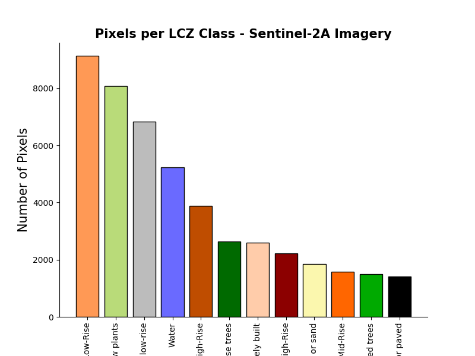

# Local Climate Zone Classification using Random Forest with Sentinel-2A Imagery and Urban Canopy Parameters

This project is inspired by **Vavasorri et al. (2024)**:

Alberto Vavassori, Daniele Oxoli, Giovanna Venuti, Maria Antonia Brovelli, Mario Siciliani de Cumis, Patrizia Sacco, Deodato Tapete, A combined Remote Sensing and GIS-based method for Local Climate Zone mapping using PRISMA and Sentinel-2 imagery, International Journal of Applied Earth Observation and Geoinformation, Volume 131, 2024, 103944, ISSN 1569-8432, https://doi.org/10.1016/j.jag.2024 103944.

## Sentinel-2 Data Exploration of LCZ Training Areas

### Pixel Counts 

### Spectral Signature 

### Jeffries-Matuista Distance

## Training Random Forest to Classify LCZs on Sentinel-2 Imagery

### Confusion Matrix

### Feature Importances

