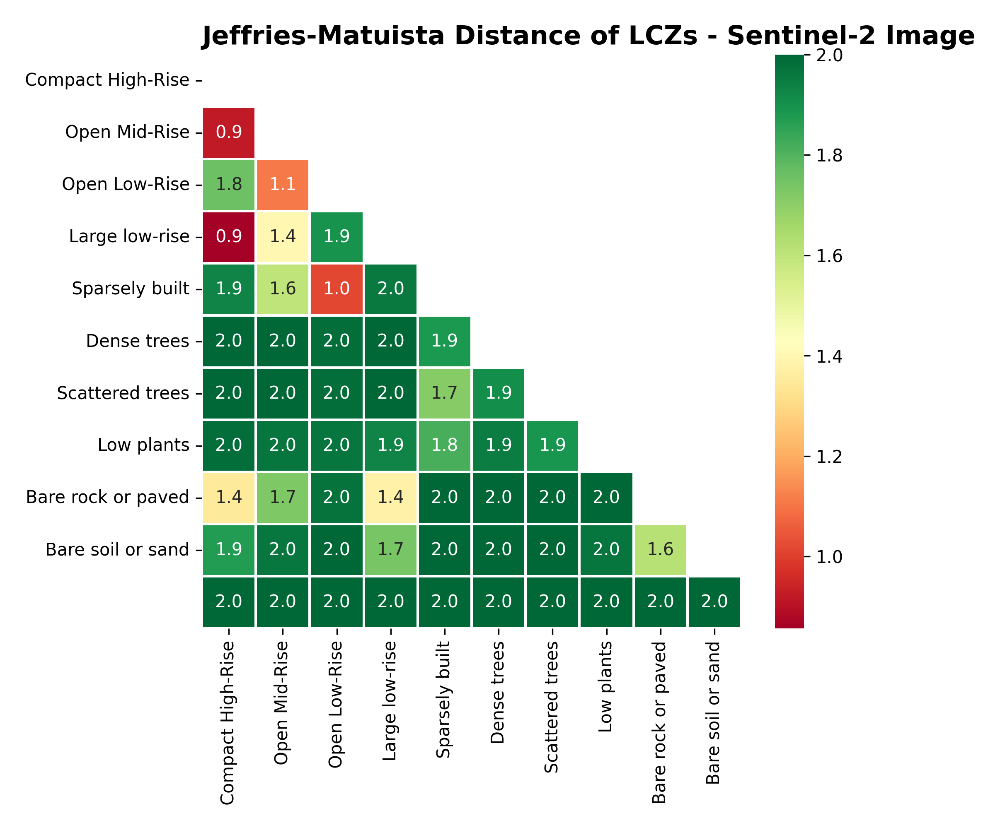

# Urban Heat Island Analysis on Toronto using Automated Local Climate Zone Classification
Automated classification of Local Climate Zones (LCZs) using Random Forest trained on Sentinel-2 L2A imagery and GIS-derived Urban Canopy Parameters for intra-urban urban heat island analysis in Toronto, Ontario, Canada.

  

### 1. Local Climate Zones

The Urban Heat Island (UHI) effect is a phenomenon whereby air temperatures in urban environments are significantly heightened when compared to rural areas. Such an effect is largely due to the thermal properties of urban structures, which tend to absorb heat during the day and release it during the night. Traditional studies typically measured UHI using dichotomous urban / rural classification when comparing temperature trends. Such an approach fails to capture the diverse nature of urban areas, whereby building height, compactness and vegetation cover can vary substantially over space. Developed Stewart and Oke (2012), the Local Climate Zone (LCZ) classification scheme aims to characterise The scheme comprises 17 zones based mainly on properties of surface structure (e.g., building and tree height & density) and surface cover (pervious vs. impervious). Each zone is local in scale, meaning it represents horizontal distances of 100s of metres to several kilometres.  The scheme is a logical starting point for WUDAPT’s aim to gather consistent information across cities globally. To learn more about the Local Climate Zone framework, you can refer to the [WUDAPT Webpage](https://www.wudapt.org/lcz/). A useful resource to better undetstand LCZ can be found in this [illustration by Demuzere et al (2020)](https://www.wudapt.org/wp-content/uploads/2021/03/LCZ_Typology_Demuzere2020.pdf).

### 2. A Toronto Case Study

This project explores the application of LCZs for understanding the UHI in the city of Toronto, Ontario. A study in 2021 found that Toronto experienced an annual average daytime UHI intensity of 4.3 C (Duan et al. 2024).

Primary Objectives:
1. Train a Random Forest classifier on Sentinel-2 Imagery and GIS-derived Urban Canopy Parameters to predict LCZ classes for the city of Toronto
2. Benchmark performance of the trained model to that of the LCZ Generator (Coming Soon)
3. Analyze the Urban Heat Island Effect in the Toronto using classified LCZs (Coming Soon)

### 3. Datasets

#### Sentinel-2 L2A Imagery

As per Vavassori et al. (2024), bands from B02 to B07, B8A, B11, and B12 were utilized from the harmonized Sentinel-2 L2A dataset. Below is an RGB composite of the Sentinel-2 imagery collected on 15th of May, 2023.

Spectral Signature of LCZ Classes 

Spectral Seperability Between Classes using Jeffries-Matuista Distance

#### 3.2. Urban Canopy Parameters

### 3. LCZ Classification with Random Forest

A Random Forest Classifier was trained on Sentinel-2 imagery and GIS-derived Urban Canopy Parameters to predict LCZ classes, data processing, data exploration and model assessment follows the methodology from Vavasorri et al. (2024). The trained model attained an overall testing accuracy of 82%, the classification report, confusion matrix and feature importances are given below.

### Accuracy Metrics

|                    | precision | recall | f1-score | support |
| ------------------ | --------- | ------ | -------- | ------- |
| Compact High-Rise  | 0.85      | 0.79   | 0.82     | 397     |
| Compact Mid-Rise   | 0.73      | 0.49   | 0.59     | 415     |
| Compact Low-Rise   | 0.69      | 0.72   | 0.7      | 1145    |
| Open High-Rise     | 0.51      | 0.37   | 0.43     | 426     |
| Open Mid-Rise      | 0.59      | 0.31   | 0.41     | 538     |
| Open Low-Rise      | 0.65      | 0.71   | 0.68     | 1225    |
| Large low-rise     | 0.78      | 0.88   | 0.83     | 1068    |
| Sparsely built     | 0.73      | 0.84   | 0.78     | 1259    |
| Dense trees        | 0.9       | 0.95   | 0.93     | 579     |
| Scattered trees    | 0.9       | 0.89   | 0.9      | 401     |
| Low plants         | 0.97      | 0.96   | 0.97     | 2417    |
| Bare rock or paved | 0.8       | 0.93   | 0.86     | 313     |
| Bare soil or sand  | 0.95      | 0.89   | 0.92     | 419     |
| Water              | 1.0       | 1.0    | 1.0      | 1570    |
| accuracy           | 0.82      | 0.82   | 0.82     | 0       |
| macro avg          | 0.79      | 0.77   | 0.77     | 12172   |
| weighted avg       | 0.82      | 0.82   | 0.82     | 12172   |
|                    |

#### Confusion Matrix

#### Feature Importances

### 4. Next Steps 

- Benchmarking against LCZ Generator
- Urban Heat Island Analysis

### References

Alberto Vavassori, Daniele Oxoli, Giovanna Venuti, Maria Antonia Brovelli, Mario Siciliani de Cumis, Patrizia Sacco, Deodato Tapete, A combined Remote Sensing and GIS-based method for Local Climate Zone mapping using PRISMA and Sentinel-2 imagery, International Journal of Applied Earth Observation and Geoinformation, Volume 131, 2024, 103944, ISSN 1569-8432, https://doi.org/10.1016/j.jag.2024 103944.

Ching, J., Mills, G., Bechtel, B., See, L., Feddema, J., Wang, X., Ren, C., Brousse, O., Martilli, A., Neophytou, M., Mouzourides, P., Stewart, I., Hanna, A., Ng, E., Foley, M., Alexander, P., Aliaga, D., Niyogi, D., Shreevastava, A., Bhalachandran, P., Masson, V., Hidalgo, J., Fung, J., Andrade, M., Baklanov, A., Dai, W., Milcinski, G., Demuzere, M., Brunsell, N., Pesaresi, M., Miao, S., Mu, Q., Chen, F., Theeuwes, N., 2018. WUDAPT: An Urban Weather, Climate, and Environmental Modeling Infrastructure for the Anthropocene. Bull. Amer. Meteor. Soc. 99, 1907–1924. https://doi.org/10.1175/BAMS-D-16-0236.1

Demuzere M, Hankey S, Mills G, Zhang W, Lu T, Bechtel B. Combining expert and crowd-sourced training data to map urban form and functions for the continental US. Sci Data. 2020;7(1):264. doi:10.1038/s41597-020-00605-z.

Demuzere, M., Kittner, J., Bechtel, B. (2021). LCZ Generator: a web application to create Local Climate Zone maps. Frontiers in Environmental Science 9:637455. https://doi.org/10.3389/fenvs.2021.637455

Duan, Yuwei and Agrawal, Sandeep and Sanchez-Azofeifa, Arturo and Welegedara, Nilusha, Urban Heat Island Effect in Canada: Insights from Five Major Cities. Available at SSRN: https://ssrn.com/abstract=4965331 or http://dx.doi.org/10.2139/ssrn.4965331

Stewart ID, Oke TR. Local Climate Zones for Urban Temperature Studies. Bull Am Meteorol Soc. 2012;93(12):1879-1900. doi:10.1175/BAMS-D-11-00019.1

